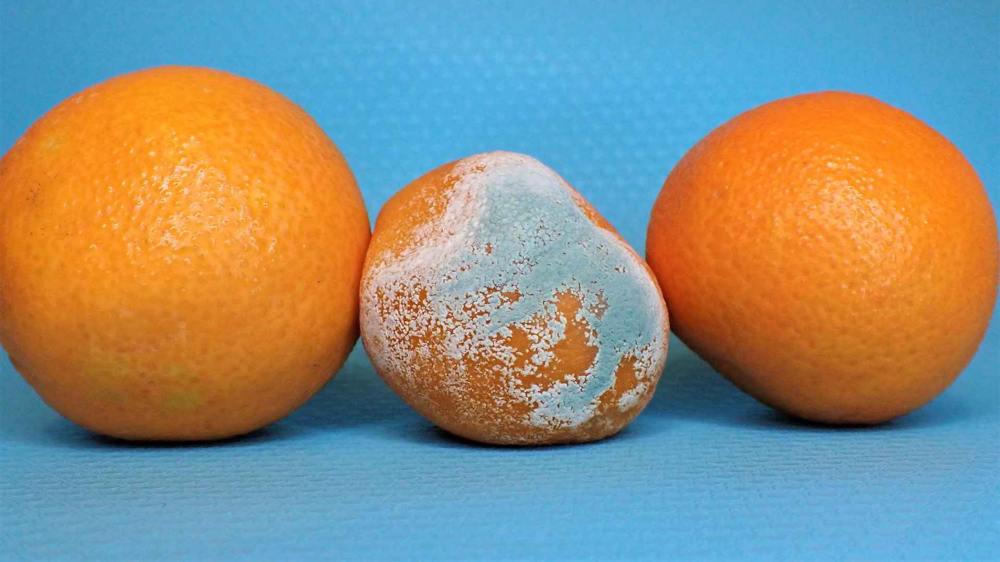

# Mold Detection - Hunting the Silent Killer
## Ironhack final project by Sebastian Bobeth, Dominik Koppen, Agata Płucienik
- Ironhack Data Analytics Bootcamp, Berlin, December 2023
- Project status: Prototype finalized

## Project scope
In our pursuit to address health risks associated with mycotoxins, we developed a mold detector application prototype for fruits and vegetables with Python deep learning and machine learning. Our application uses image recognition to identify mold on vegetables and fruits (mold / no mold detector) using a Python function. This can help older individuals who are more susceptible to health issues caused by moldy groceries. Furthermore, our application classifies the food category of the input image (fruit and vegetable classifier). This can be used to provide additional information on, for example, durability and proper storage practice in future versions of the application. The prototype is displayed on an interactive interface using Streamlit. With this prototype, we provide a practical approach to enhance food safety and well-being.

## Tech used
We used Python (Jupyter Notebook, Google Colab, Visual Studio Code) for most steps of the process. In specific, we used the following modules for the following steps:
- Pillow, OpenCV: Image processing, webcam capture feature (yet to be integrated in application)
- Bing Image Downloader: Image web scraping
- Matplotlib: Image depiction
- Scikit-Learn: Unsupervised machine learning (KMeans)
- TensorFlow Keras: Supervised machine learning (CNNs)
- Streamlit: Interface building.

## Product prototype
You can see screenshots of the prototype in the 'app/screenshots' folder.

#### Flow and components
- **Image upload**: The user can upload an image.
- **Preprocessing**: The image is preprocessed (for example, background is removed, image is flattened - this is important for the following steps).
- **Display of images**: The unprocessed and the processed image are shown to the user.
- **Display of main colors**: The Python function to detect mold currently works with colors. Hence, the main colors of the image are displayed to the user. To achieve this, the colors of the image are HEX labeled and and a KMeans model is trained on the colors of the image. The user can define the number of clusters. The centroid of each cluster represents the average color of each cluster (as a main color) and is shown to the user in a pie chart (the size of the pieces is determined by the total number of similar colors in the respective cluster).
- **Mold / no mold detection and warning**: A function checks if certain colors typical for mold occur suspiciously often in the image or not. Currently, the function checks for certain grey colors. These typically do not appear in fruits or vegetables but in mold. If a suspicious amount appears, the application warns the user that there could be mold.
- **Fruit and vegetable classification**: The image is input into a pre-trained CNN (convolutional neural network) model that predicts the type of fruit or vegetable (the model had an accuracy of 97% on the test set; see folders 'final_models' and 'model_creation' for more information on the model specifications and folder 'tableau_visualizations' for the training history). The classification is shown to the user.

#### Features for the future
- **Webcam capture feature**: The user takes an image of a fruit or vegetable with their mobile camera or webcam. This feature could not be integrated into the prototype in time due to OS issues. We provide the code in the 'webcam_capture_feature' folder in this repo.
- **Improved color detection in mold / no mold detection**: The recall of the mold / no mold detection function is currently at only 44%. This could be improved by refining the grey area in mold detection colors and by integrating certain types of turquoise, which we could not do in time.
- **Mold / no mold detection with supervised machine learning (CNN)**: Due to limited (time and computer power) resources, we could not finalize the integration of a machine learning model (CNN) for mold prediction into the prototype. The best model we could train on our web-scraped dataset achieved a recall of 90% on the test set, but we still suspect it to overfit after seeing the training history and implementing further tests. More images, more diverse images, and an improved model building or training process should further improve the quality of the predictions. More information and the related code can be found in the folder 'final_models' and 'model_creation' in this repo. The training history can be seen in the 'tableau_visualizations' folder.

#### Using the app
To use the app, fork the repo and run the app.py file in the 'app' folder. We can provide the model on request (it is appx. 1GB large). You will need to adjust the 'model_path' value in the prediction.py file according to the new directory. We ran the model with Tensorflow version 2.14.

## Datasets
#### Fruit/vegetable classifier
We used the following image dataset for training of the fruit and vegetable classification model:
- "Fruits and Vegetables Image Recognition Dataset"
- 4,320 images: 100 training images, 10 test images, 10 validation images in each of the 36 fruits/vegetables classes
- [Link to the dataset](https://www.kaggle.com/datasets/kritikseth/fruit-and-vegetable-image-recognition)

#### Mold / no mold detector (machine learning version)
For training the mold / no mold detection model, we web-scraped an image dataset via Bing image search (Bing Image Downloader library) containing pictures of fruits and vegetables with mold and no mold (2,305 pictures in total). We don't provide this web-scraped database in the Github repo for copyright reasons but can provide more information on request. We included the web scraping code in the folder 'webscraping_image_database'.

## Acknowledgment
Cover photo by <a href="https://unsplash.com/@mostlymarvelling?utm_content=creditCopyText&utm_medium=referral&utm_source=unsplash">Nancy Hughes</a> on <a href="https://unsplash.com/photos/three-oranges-and-an-egg-on-a-blue-background-CswOWBovmVs?utm_content=creditCopyText&utm_medium=referral&utm_source=unsplash">Unsplash</a>.
